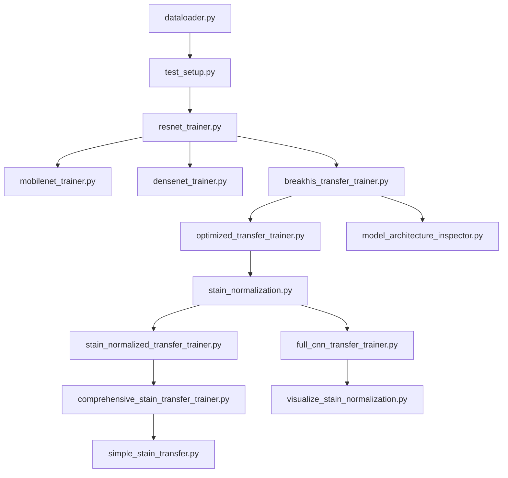

# CS614 Deep Learning Scripts Comparison

## Overview
This document provides a comprehensive comparison of all Python scripts in the CS614 repository, focusing on their purpose, similarities, and key differences for transfer learning experiments on histopathology datasets.

## Quick Reference Table

| Script | Primary Purpose | Dataset(s) | Models | Training Strategy | Stain Norm | Advanced Features |
|--------|----------------|------------|---------|-------------------|------------|-------------------|
| `dataloader.py` | **Utility** | Osteosarcoma | N/A | N/A | ❌ | Data augmentation |
| `test_setup.py` | **Testing** | Osteosarcoma | ResNet50 | Test only | ❌ | Basic validation |
| `resnet_trainer.py` | **Basic Training** | Osteosarcoma | ResNet50 | Full fine-tuning | ❌ | Single-layer classifier |
| `mobilenet_trainer.py` | **Basic Training** | Osteosarcoma | MobileNetV2 | Full fine-tuning | ❌ | Single-layer classifier |
| `densenet_trainer.py` | **Basic Training** | Osteosarcoma | DenseNet121 | Full fine-tuning | ❌ | Single-layer classifier |
| `breakhis_transfer_trainer.py` | **Cross-Domain Transfer** | BreakHis → Osteosarcoma | ResNet50, MobileNetV2, DenseNet121 | Last 2 layers only | ❌ | Kaggle integration |
| `optimized_transfer_trainer.py` | **Advanced Transfer** | BreakHis → Osteosarcoma | ResNet50, MobileNetV2 | Configurable layers (1-4) | ❌ | AdamW, CosineAnnealing, Multi-layer classifier |
| `full_cnn_transfer_trainer.py` | **Full CNN Training** | BreakHis → Osteosarcoma | ResNet50, MobileNetV2, DenseNet121 | Entire CNN + simple classifier | ✅ Reinhard | Feature-level alignment |
| `stain_normalized_transfer_trainer.py` | **Stain Experiments** | BreakHis → Osteosarcoma | ResNet50 | Last 2 layers | ✅ All methods | Basic implementation |
| `comprehensive_stain_transfer_trainer.py` | **Ultimate Script** | BreakHis → Osteosarcoma | ResNet50, MobileNetV2 | Configurable layers (1-4) | ✅ All methods | All advanced features |
| `simple_stain_transfer.py` | **Isolated Stain Test** | BreakHis → Osteosarcoma | ResNet50 | Single layer (layer4) | ✅ Reinhard only | Minimal features |
| `stain_normalization.py` | **Utility Library** | N/A | N/A | N/A | ✅ Implementation | Reinhard, Macenko, Vahadane |
| `visualize_stain_normalization.py` | **Visualization** | BreakHis + Osteosarcoma | N/A | N/A | ✅ Reinhard | Image comparison plots |
| `model_architecture_inspector.py` | **Analysis Tool** | N/A | ResNet50, MobileNetV2 | N/A | ❌ | Parameter analysis |

---

## Detailed Script Analysis

### 1. Core Training Scripts (Direct Osteosarcoma Training)

#### `resnet_trainer.py`, `mobilenet_trainer.py`, `densenet_trainer.py`
**Purpose**: Basic transfer learning on osteosarcoma dataset using different CNN architectures.

**Similarities**:
- All use ImageNet pre-trained weights
- Single-layer classifier: `nn.Sequential(nn.Dropout(0.5), nn.Linear(num_features, num_classes))`
- Same training loop with Adam optimizer
- Comprehensive metrics (F1, precision, recall) for train/val/test splits
- Learning rate scheduling with `StepLR`
- Training history plotting

**Differences**:
| Feature | ResNet50 | MobileNetV2 | DenseNet121 |
|---------|----------|-------------|-------------|
| **Architecture** | `models.resnet50` | `models.mobilenet_v2` | `models.densenet121` |
| **Classifier Access** | `.fc` | `.classifier[1]` | `.classifier` |
| **Feature Count** | 2048 | 1280 | 1024 |
| **Weights** | `IMAGENET1K_V2` | `IMAGENET1K_V2` | `IMAGENET1K_V1` |

### 2. Cross-Domain Transfer Learning Scripts

#### `breakhis_transfer_trainer.py`
**Purpose**: Train on BreakHis (breast cancer), then transfer to Osteosarcoma (bone cancer).

**Key Features**:
- Kaggle dataset integration (`kagglehub`)
- Trains **only last 2 CNN layers** (not just classifier)
- Three model variants: ResNet50, MobileNetV2, DenseNet121
- Custom freezing logic for each architecture
- Cross-domain evaluation

**Layer Freezing Strategy**:
- **ResNet50**: Freeze all except `layer3`, `layer4`
- **MobileNetV2**: Freeze all except last 2 feature blocks
- **DenseNet121**: Freeze all except `denseblock3`, `denseblock4`

#### `optimized_transfer_trainer.py`
**Purpose**: Advanced transfer learning with configurable trainable layers and optimization techniques.

**Advanced Features**:
- **Configurable layers**: 1-3 for ResNet, 2-4 for MobileNet
- **AdamW optimizer** with weight decay
- **CosineAnnealingWarmRestarts** scheduler
- **Label smoothing** (0.1)
- **Gradient clipping** (max_norm=1.0)
- **Multi-layer classifier**: BatchNorm1d + ReLU + Dropout layers
- **Best result**: 93.2% accuracy

#### `full_cnn_transfer_trainer.py`
**Purpose**: Train the **entire CNN** on BreakHis, then use as frozen feature extractor for Osteosarcoma.

**Unique Approach**:
- Phase 1: Train **all layers** on BreakHis with simple classifier
- Phase 2: Freeze CNN, train **only new classifier** on Osteosarcoma
- **Feature-level alignment**: Moment matching, BatchNorm, LayerNorm, InstanceNorm
- **Stain normalization**: Reinhard method
- Tests feature extraction quality of fully-trained CNNs

### 3. Stain Normalization Scripts

#### `stain_normalization.py`
**Purpose**: Library implementing stain normalization methods.

**Methods Implemented**:
- **Reinhard**: LAB color space statistical matching
- **Macenko**: H&E stain separation using SVD
- **Vahadane**: Non-negative matrix factorization approach
- **Color Transfer**: Simple RGB statistical matching

#### `stain_normalized_transfer_trainer.py`
**Purpose**: Basic integration of stain normalization with transfer learning.

**Features**:
- Tests all stain methods (Reinhard, Macenko, Vahadane)
- Fixed architecture (ResNet50, last 2 layers trainable)
- Feature-level moment matching
- Basic training setup

#### `comprehensive_stain_transfer_trainer.py`
**Purpose**: **Ultimate script** combining all advanced techniques.

**Comprehensive Features**:
- **4 stain methods** × **5 architecture configs** = 20 experiments
- All advanced training techniques from `optimized_transfer_trainer.py`
- Configurable trainable layers (1-3 for ResNet, 2-4 for MobileNet)
- Multi-layer advanced classifiers
- Complete experimental matrix

#### `simple_stain_transfer.py`
**Purpose**: Isolated test of Reinhard stain normalization effect.

**Minimal Design**:
- **Only Reinhard** stain normalization
- **Only ResNet50** with 1 trainable layer (layer4)
- **Simple classifier**: Dropout + Linear
- **Basic training**: Simple Adam, no advanced techniques
- **Goal**: Clean comparison of stain normalization impact

### 4. Utility and Analysis Scripts

#### `dataloader.py`
**Purpose**: Data loading utility for osteosarcoma dataset.

**Features**:
- Extensive data augmentation for training
- Standard transforms for validation/test
- Handles 3-class osteosarcoma classification
- PIL truncated image handling

#### `visualize_stain_normalization.py`
**Purpose**: Visual comparison of original vs. stain-normalized images.

**Features**:
- Side-by-side image comparisons
- Headless environment compatible (`matplotlib.use('Agg')`)
- Saves PNG outputs for manual inspection
- Tests Reinhard normalization quality

#### `model_architecture_inspector.py`
**Purpose**: Detailed analysis of model architectures and parameter counts.

**Features**:
- Layer-by-layer parameter breakdown
- Trainable vs. frozen parameter identification
- Architecture comparison across models
- Debugging tool for understanding model structure

#### `test_setup.py`
**Purpose**: Quick validation script for basic setup verification.

**Features**:
- Tests data loading functionality
- Validates model creation
- Checks forward pass execution
- Pre-training verification tool

---

## Key Similarities Across Scripts

### 1. **Common Dependencies**
```python
import torch
import torch.nn as nn
import torch.optim as optim
from torchvision import models, transforms
from sklearn.metrics import precision_recall_fscore_support
```

### 2. **Standard Model Loading Pattern**
```python
# All scripts use ImageNet pre-trained weights
models.resnet50(weights='IMAGENET1K_V2')
models.mobilenet_v2(weights='IMAGENET1K_V2') 
models.densenet121(weights='IMAGENET1K_V1')
```

### 3. **Common Evaluation Metrics**
- Accuracy, Precision, Recall, F1-score
- Train/Validation/Test split evaluation
- Confusion matrix generation (in advanced scripts)

### 4. **Shared Training Patterns**
- Early stopping based on validation accuracy
- Model checkpointing (best validation performance)
- Training history tracking and plotting

---

## Key Differences

### 1. **Training Strategy Spectrum**

| Approach | Scripts | Description |
|----------|---------|-------------|
| **Full Fine-tuning** | `resnet_trainer.py`, `mobilenet_trainer.py`, `densenet_trainer.py` | Train all layers on target dataset |
| **Selective Fine-tuning** | `breakhis_transfer_trainer.py`, `optimized_transfer_trainer.py` | Train only last N layers |
| **Feature Extraction** | `full_cnn_transfer_trainer.py` | Freeze CNN, train only classifier |
| **Hybrid Approach** | `comprehensive_stain_transfer_trainer.py` | Multiple strategies in one script |

### 2. **Complexity Levels**

| Level | Scripts | Characteristics |
|-------|---------|----------------|
| **Basic** | Basic trainers, `simple_stain_transfer.py` | Simple optimizers, basic classifiers |
| **Intermediate** | `breakhis_transfer_trainer.py`, `stain_normalized_transfer_trainer.py` | Cross-domain transfer, basic stain norm |
| **Advanced** | `optimized_transfer_trainer.py`, `comprehensive_stain_transfer_trainer.py` | All optimization techniques |
| **Experimental** | `full_cnn_transfer_trainer.py` | Novel training approaches |

### 3. **Dataset Usage Patterns**

| Pattern | Scripts | Source Dataset | Target Dataset |
|---------|---------|----------------|----------------|
| **Direct Training** | Basic trainers | N/A | Osteosarcoma |
| **Cross-Domain** | Transfer trainers | BreakHis (Breast) | Osteosarcoma (Bone) |
| **Utility** | `dataloader.py`, utilities | N/A | Osteosarcoma |

### 4. **Optimization Sophistication**

| Feature | Basic Scripts | Advanced Scripts |
|---------|---------------|------------------|
| **Optimizer** | Adam | AdamW with weight decay |
| **Scheduler** | StepLR | CosineAnnealingWarmRestarts |
| **Regularization** | Dropout only | Label smoothing, gradient clipping |
| **Classifier** | Single linear layer | Multi-layer with BatchNorm |

---

## Parameter Count Explanation

### Why `simple_stain_transfer.py` shows 63.7% trainable parameters?

**Answer**: ResNet50's `layer4` is actually quite large! Here's the breakdown:

- **Total ResNet50 parameters**: ~23.5M
- **layer4 parameters**: ~14.7M (≈62.5%)
- **Simple classifier parameters**: ~4K (≈0.02%)
- **Total trainable**: ~14.7M (≈63.7%)

**layer4 contains**:
- 3 bottleneck blocks with 2048 channels
- Each block has multiple conv layers + batch norms
- This is where most of the high-level feature learning happens

**So "1 layer" actually means "the final major CNN block" which is substantial!**

---

## Evolution Timeline



## Best Practices Learned

### 1. **Model Architecture Choices**
- **ResNet50**: Best overall performance, good balance of accuracy and efficiency
- **MobileNetV2**: Faster training, slightly lower accuracy
- **DenseNet121**: Compact, good feature reuse

### 2. **Transfer Learning Strategies**
- **Last 2-3 layers**: Good balance between adaptation and overfitting
- **Full CNN training**: Best when source domain is very different
- **Feature extraction**: Good when datasets are similar

### 3. **Optimization Insights**
- **AdamW + CosineAnnealing**: Superior to basic Adam + StepLR
- **Label smoothing**: Helps with overfitting
- **Multi-layer classifiers**: Better than single linear layer

### 4. **Domain Adaptation Findings**
- **Stain normalization**: Mixed results, can hurt performance
- **Feature-level alignment**: More reliable than image-level
- **Cross-domain transfer**: Challenging, requires careful tuning

---

## Recommended Usage

### For New Users:
1. Start with `test_setup.py` to verify environment
2. Try `resnet_trainer.py` for basic transfer learning
3. Move to `breakhis_transfer_trainer.py` for cross-domain experiments

### For Advanced Experiments:
1. Use `optimized_transfer_trainer.py` for best performance
2. Try `comprehensive_stain_transfer_trainer.py` for complete experiments
3. Use `simple_stain_transfer.py` for isolated testing

### For Analysis:
1. `model_architecture_inspector.py` for understanding models
2. `visualize_stain_normalization.py` for stain method evaluation
3. `stain_normalization.py` for implementing custom methods

---

## Performance Summary

| Script | Best Test Accuracy | Key Achievement |
|--------|-------------------|-----------------|
| `optimized_transfer_trainer.py` | **93.2%** | Best overall performance |
| `resnet_trainer.py` | ~85-90% | Solid baseline |
| `comprehensive_stain_transfer_trainer.py` | ~85-90% | Most comprehensive |
| `simple_stain_transfer.py` | ~74-77% | Clean stain comparison |
| `full_cnn_transfer_trainer.py` | ~80-85% | Novel approach validation |

---

*Generated on: $(date)*
*Repository: CS614 Deep Learning Transfer Learning Experiments*
